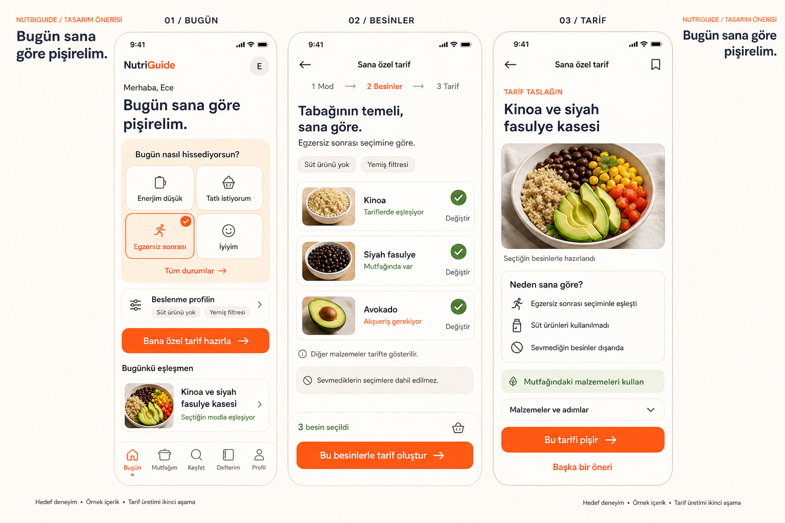

# NutriGuide — kişiselleştirmeyi merkeze taşıyan tasarım

7 Eylül 2026 · Tasarım değerlendirmesi · Uygulamaya uygulanmadı

## Ürün kararı

Ana ekranın vaadi **“Bugün sana göre pişirelim.”** olmalı. Kullanıcı uygulamayı açınca ne hissettiğini seçmeli, bunun besin seçimini nasıl etkilediğini görmeli ve kendisine önerilen tarifin gerekçesini anlayabilmeli.

Ana döngü: **Günlük durum → beslenme profiliyle filtrelenen besinler → kişisel tarif → pişirme → geri bildirim.**

Bugünkü sorun yalnızca bir özelliğin küçük çizilmesi değil; ekran sırası, öneri sıralaması ve kullanılan dilin farklı ürün vaatleri vermesi. Görünüm ile öneri davranışı birlikte ele alınmalı.

## İncelemenin kapsamı

Bu değerlendirme mevcut Flutter ekranlarının widget yapısına, Riverpod sağlayıcılarına, öneri servisine ve tarif verisine dayanır. Çalışan uygulamanın cihaz ekran görüntüsü üzerinden yapılmış bir görsel denetim veya kullanıcı araştırması değildir. Aşağıdaki kullanılabilirlik sonuçları, koddan yapılan tasarım çıkarımlarıdır.

Tarif dosyalarında mevcut toplam 144 tarif doğrulandı. Görseldeki Ece, profil seçimleri ve mutfak durumu örnek senaryodur. Kinoa ve Siyah Fasulye Kasesi mevcut katalogda `l003` kimliğiyle bulunur; görseldeki sunum ve üretim akışı hedef deneyimi temsil eder.

## Mevcut yapıda özellik neden geri planda?

| Bulgular | Kod kanıtı | Ürüne etkisi |
|---|---|---|
| Mod günün girişinde soruluyor, ana sayfada küçük bir duruma dönüşüyor. | `lib/main.dart:119`, `lib/screens/home/home_screen.dart:268` | Kullanıcı seçimi yapıyor ama sonrasında seçimin önemini sürekli göremiyor. |
| Ana sayfada sıralama: başlık → sağlık ipucu → iki günlük plan → beslenme özeti → günün tarifleri. | `lib/screens/home/home_screen.dart:75–103` | İlk görünüm kişisel tarif hazırlamaktan çok takip panelini anlatıyor. |
| İpucu karuselinin ilk içeriği genel sağlık ipucu; moda bağlı içerik ikinci sırada. | `lib/screens/home/home_screen.dart:443` | Kişisel bağlam, rastgele bir bilgi kartıyla görsel olarak yarışıyor. |
| “Sana Özel”, Keşfet içinde ikinci sekme. İlk sekme dünya mutfakları. | `lib/screens/explore/explore_screen.dart:28`, `:114–115` | Ürünün ayırt edici yönü katalog içinde bir kategori gibi algılanabilir. |
| Malzeme eşleşmesi skora en fazla 0,45; mod eşleşmesi 0,28; sağlık eşleşmesi 0,20 katkı yapıyor. | `lib/services/recommendation_service.dart:102` | Modla eşleşmeyen ama malzemesi evde bulunan bir tarif daha yukarı çıkabilir. Mod değiştirmek görünür sonucu her zaman değiştirmeyebilir. |
| “Uyum yüzdesi” evde bulunan malzeme sayısının tüm malzemelere oranı. | `lib/services/recommendation_service.dart:27`, `lib/screens/recipe_detail/recipe_detail_screen.dart:36–82` | Kişiye, moda veya alerjiye uygunluk ölçüsü sanılabilir. |
| Tarif detayında moda ve profile bağlı bir gerekçe bileşeni yok. | `lib/screens/recipe_detail/recipe_detail_screen.dart` | Kullanıcı arka plandaki kişiselleştirmeyi denetleyemiyor. |
| Kaynak katalog ve kullanıcı tarafından girilen tarifler; öneri servisi filtreleyip sıralıyor. | `lib/providers/recipe_provider.dart`, `lib/screens/my_recipes/create_recipe_screen.dart` | “Yeni tarif üretme” vaadi bugün çalışan işlevle aynı değil. Üretim ayrıca geliştirilmeli. |

Mevcut filtreleme değerli bir temel: önerilerde alerjen, sevilmeyen malzeme ve diyet tercihi elemesi zaten var. Keşfet'te ise alerjenler elenirken diğer tercih uyumsuzlukları aşağı sıralanıyor. Bu iki davranışın kullanıcıya aynı “sana özel” etiketiyle sunulmaması gerekir.

## Önerilen üç ekran

### 1. Bugün: ürün vaadi ilk görünümde

- Küçük marka ve selamlama; büyük başlık: **Bugün sana göre pişirelim.**
- En baskın alan: **Bugün nasıl hissediyorsun?** Dört hızlı seçenek ve “Tüm durumlar”. Tam listede mevcut dokuz durum korunur. “İyiyim”, `noSpecificIssue` için olumlu kullanıcı dilidir.
- Seçili durum renk, işaret ve metinle belirginleşir; sadece renge dayanmaz. Gün içinde aynı alandan değiştirilebilir.
- Hemen altında **Beslenme profilin**: etkin tercihlerin ve alerjen filtrelerinin kısa özeti. Örnekte “Süt ürünü yok”, “Yemiş filtresi”. Dokununca ayrıntılar açılır; kategori ve tam alerjen adları gösterilir.
- Tek ana buton: **Bana özel tarif hazırla**.
- Ardından “Bugünkü eşleşmen”: bir ana tarif, açık eşleşme gerekçesi ve daha fazla öneriye erişim.
- Plan ve tüketim özeti aşağı taşınır. Sağlık ipuçları ilgili tarif veya besin açıklamasının yanında, kullanıcının o anki kararını desteklediğinde gösterilir.

Önerilen alt menü: **Bugün · Mutfağım · Keşfet · Defterim · Profil**. Mevcut beş sekme korunabilir; yeni bir alt menü sekmesi gerekmiyor. Tarif hazırlama ana ekranın doğal devamıdır.

Açılıştaki zorunlu ayrı mod ekranını, ana ekranın boş durumuyla birleştirmek önerilir. Mod seçmeyen kullanıcıya “Profilime göre devam et” sunulur; mod seçilmediyse sonuçta moda ilişkin gerekçe yazılmaz. Bu yolun çalışması için mevcut `recommendationsProvider` null davranışı uyarlanmalıdır.

### 2. Besinler: kişiselleştirmenin görünür olduğu adım

Başlık: **Tabağının temeli, sana göre.** Üstte seçili durum ve profil özeti korunur. Üç veya dört öne çıkan besin, seçilme gerekçesi ve mutfakta bulunma durumuyla gösterilir.

Örnek: kinoa, siyah fasulye, avokado. “Mutfağında var” yalnızca envanterdeyse; “Alışveriş gerekiyor” yalnızca eksikse yazılır. Bunlar örnek ana besinlerdir; yağ, baharat ve diğer malzemeler nihai tarifte eksiksiz listelenir.

Kullanıcı besini çıkarabilir veya değiştirebilir. Alternatifler aynı profil kurallarından geçer. Bu ekran isteğe bağlı kontrol noktasıdır: kullanıcı her gün uzun bir forma zorlanmaz. Ana sayfadaki mevcut eşleşme kartından doğrudan tarife de ulaşabilir.

**Birinci aşamada:** “Bu besinlerle tarif bul” butonu katalogda arar. Gösterilen kombinasyon en az bir uygun tarifle desteklenmelidir; bağımsız seçilmiş üç besinin birlikte hiçbir tarifte bulunmaması önlenir.

**İkinci aşamada:** “Bu besinlerle tarif oluştur” yeni tarif taslağı üretir. Görsel bu hedef akışı gösterir. Üretim servisi devreye alınmadan bu buton yayımlanmamalıdır.

### 3. Tarif: sonuç ve gerekçe birlikte

İştah açıcı görsel ve tarif adının hemen yanında **Neden sana göre?** bölümü yer alır. Örnek gerekçeler:

- “Egzersiz sonrası seçiminle eşleşti.” Yalnızca gerçekten eşleştiyse.
- “Süt ürünleri kullanılmadı.” Yalnızca tarif içeriği doğrulandıysa.
- “Sevmediğin besinler dışarıda.” Yalnızca kullanıcı bu tercihi belirtmişse ve kontrol geçmişse.

Mutfak uygunluğu ayrı bir satırdır: **“11 malzemenin 8'i mutfağında”** gibi gerçek sayılarla gösterilir. Kişisel uyum yüzdesi kullanılmaz.

Birinci aşama katalog sonucunda “Senin için seçildi”; ikinci aşama üretim sonucunda “Tarif taslağın” yazılır. Tarifin kaynağı anlaşılır olmalıdır.

“Bu tarifi pişir” adımları açar; kendiliğinden tüketim kaydı oluşturmaz. Tamamlandıktan sonra ayrı “Pişirdim” eylemi mevcut `cookedProvider` akışını kullanır. “Plana ekle”, “Kaydet” ve “Eksikleri alışverişe ekle” ikincil eylemlerdir.

Pişirme sonrasında kısa geri bildirim: “Beğendim / Bana göre değildi”. İlk aşamada kayıt ve tekrarları azaltma için kullanılabilir; mevcut uygulamada öğrenen bir alışkanlık modeli varmış gibi sunulmaz.

## Öneri mantığının tasarıma uyması

Sadece 0,28 ağırlığını yükseltmek yerine açıklanabilir gruplama önerilir:

1. **Zorunlu eleme:** bildirilen alerjenler ve öneri akışındaki beslenme dışlamaları uygulanır. Malzeme değiştirme ve tarif üretme de aynı kontrolden geçer.
2. **Kişisel eşleşme:** uygun tarifler içinde seçili günlük durumla eşleşenler ilk grupta gösterilir. Sürekli tercihler ve diğer bildirimler sonucu açıklamak için kullanılır. Mevcut sağlık eşleşmesinin bir bonus olduğu, tıbbi uygunluk garantisi olmadığı korunur.
3. **Pratik sıralama:** aynı grupta envanter, biliniyorsa hazırlık süresi ve çeşitlilik sıralamayı belirler.
4. **Açık alternatif:** modla eşleşen tarif yoksa “Bu mod için eşleşme bulamadık. Profiline göre alternatifler” gösterilir. Alerjen filtresi hiçbir durumda gevşetilmez.

Kullanıcı “Önce evdekiler” seçerse sıralama tercihini bilinçli olarak değiştirir. Böylece stok ağırlığının mod deneyimini sessizce bastırması önlenir.

`ScoredRecipe` mevcut durumda mod eşleşmesini ve açıklama nedenlerini taşımıyor. `matchReasons`, `checkInMatched` ve `pantryMatch` gibi yapılandırılmış bilgiler eklenmesi önerilir. Gerekçeler arayüzün serbestçe yazdığı metinler değil, gerçek eşleşme verilerinin TR/EN karşılıkları olmalı.

“Alışkanlık” için bugün mevcut olan veri: beslenme tercihleri, sevilmeyenler, aktivite düzeyi, tüketim kayıtları. Süre tercihi, sevilen mutfaklar, ekipman ve geçmiş seçimlerden öğrenme ayrı geliştirmedir. İlk sürümde kullanıcının açıkça belirttiği tercihler öne çıkarılmalı.

Profilde alerjenler, beslenme tercihleri ve günlük durumlar ayrı düzenleme alanlarında kalmalı. Mevcut `dairy` sözlüğü süt ürünleri/laktozu tek etikette topluyor; tasarım bu veriye dayanarak daha ayrıntılı hassasiyet ayrımı yapıyormuş gibi davranmamalı. Daha ayrıntılı destek için profil şeması ve sınıflandırma ayrıca ele alınmalı.

## Flutter'da geliştirme karşılığı

| Bileşen / iş | Mevcut temel | Gerekli değişiklik |
|---|---|---|
| Büyük günlük durum paneli | `CheckInSheet`, `dailyModeProvider`, `checkInProvider` | Ana sayfada görünür seçim, ortak durum kaynağı; çift kayıt davranışı gözden geçirilir. |
| Beslenme profili özeti | `UserProfile`, `profileProvider` | Tıklanabilir özet ve eksik profil durumu. |
| Kişisel tarif akışı | `HomeScreen`, `recommendationsProvider` | Ana CTA, öne çıkan tarif, seçimsiz durum desteği. |
| Besin seçimi | Malzeme kataloğu, `health_category_info`, envanter | Uygun tarif havuzuna dayalı besin seçici ve alternatifler. Sağlık açıklamaları doğrudan günlük mod kuralı olarak kopyalanmaz. |
| Gerekçeli tarif kartı | `ScoredRecipe`, `RecipeCard`, `RecipeDetailScreen` | Yapılandırılmış eşleşme nedenleri; stok oranının doğru adlandırılması. |
| Plan ve tüketim | `mealPlanProvider`, `cookedProvider` | Var olan akışların yeni ekran önceliğine yerleştirilmesi. |
| Fotoğraflı sunum | `RecipeVisual.imagePath` | Seçili tariflere gerçek asset sağlanması; mevcut fallback korunabilir. Tasarım görselleri var olan asset gibi kabul edilmez. |
| Yeni tarif üretimi | Şu anda üretim servisi yok | Sunucu üzerinden üretim, şema ve içerik doğrulaması, hata/çevrimdışı akışı. |

Görsel sistem: mevcut lacivert `#1B2838` ve turuncu `#FF6B35` korunur. Arka plan sıcak kırık beyaza yaklaşır (`#FAF7F2`). Soluk kayısı mod alanını, yeşil seçili besin ve envanter durumunu destekler. Her bölümde farklı parlak renk kullanmak yerine ana eyleme görsel öncelik verilir.

Referans ölçü: 390 × 844 mantıksal piksel; yan boşluk 20, kart içi 16, kart yarıçapı 20, ana buton yüksekliği 52. Başlık 28, gövde 16, ikincil metin 12–14. En az 48 × 48 dokunma alanı; büyük yazıda satır kırılması ve dikey kaydırma desteklenir. Küçük ekranda içeriği sıkıştırmak yerine alt kart kaydırmaya bırakılır. Alt gezinme ve sabit CTA güvenli alanı dikkate alır.

## Aşamalar ve kabul koşulları

**Aşama 1 — temel kimliği görünür kıl:** Ana sayfa düzeni, görünür mod seçimi, profil özeti, katalogdan besin → tarif eşleştirmesi, gerekçe kartları ve sıralama revizyonu. Mevcut Flutter/Riverpod yapısıyla yapılabilir; yeni tarif üretimi içermez.

**Aşama 2 — kişisel tarif üret:** Profil ve seçilen besinlerden sunucu üzerinden tarif taslağı. Model çıktısının malzeme kimlikleri, miktarları, adımları ve alerjenleri doğrulanır; makrolar mevcut hesaplama mantığıyla üretilir. Geçersiz çıktı kullanıcıya sunulmaz. Ağ hatasında kaydedilmiş katalog önerilerine dönüş olur. API anahtarı mobil uygulamaya gömülmez.

**Aşama 3 — günlük kullanım:** Beğeni geri bildirimi, tekrarları azaltma, isteğe bağlı süre/ekipman tercihleri ve geçmişten kişiselleştirme. Bu verilerin nasıl kullanılacağı kullanıcıya anlaşılır biçimde açıklanır.

Geliştirme sonrasında kontrol edilecek davranışlar:

- İlk görünümde mod seçimi, profil özeti ve ana eylem bulunur; takip kartları bunların önüne geçmez.
- Mod değiştiğinde uygun aday varsa ilk öneri grubu ve gerekçeleri yeni moda göre güncellenir. Aday aynı kalabilir; yanlış bir “değişti” animasyonu yapılmaz.
- Alerjen çatışan tarif; ana kart, malzeme alternatifi ve üretilen sonuç dahil hiçbir öneri yüzeyine sızmaz.
- Profil değişince açık sonuç yeniden değerlendirilir; eski uygunluk rozeti korunmaz.
- Envanter boşken “0% uyum” yerine “Mutfağını eklersen eksikleri gösterebiliriz” gösterilir.
- Sonuç yokken durum açıklanır; zorunlu dışlamaları kaldırmak varsayılan çözüm olmaz.
- Üretim yoksa buton ve sonuçlar “bul/seçildi” dilini kullanır; “oluşturuldu” demez.
- Pişirme adımını açmak ve plana eklemek tüketim sayılmaz.
- TR/EN ve büyük yazı boyutunda temel eylemler kullanılabilir kalır.

Önerilen kullanıcı testi: Beş saniye ana ekranı gösterip “Bu uygulama sana neye göre tarif seçiyor?” sorulur. Hedef cevap günlük durum ve beslenme profilini içermelidir. Bu bir test önerisidir; henüz ölçülmüş bir sonuç değildir. Sonraki ölçümler mod seçimi → tarif açma → pişirme dönüşümü ve gerekçe bölümünün anlaşılmasıdır.

## Teslim kapsamı

Üç ekranlı hedef tasarım görseli ve bu uygulama planı, geliştirme kararı için hazırlanmıştır. Uygulamanın kaynak kodunda, tarif verisinde ve mevcut kullanıcı değişikliklerinde düzenleme yapılmamıştır. Görsel yapay zekâyla üretilmiş tasarım referansıdır; ölçüler ve davranışlar için bu belgedeki şartlar esas alınır.
