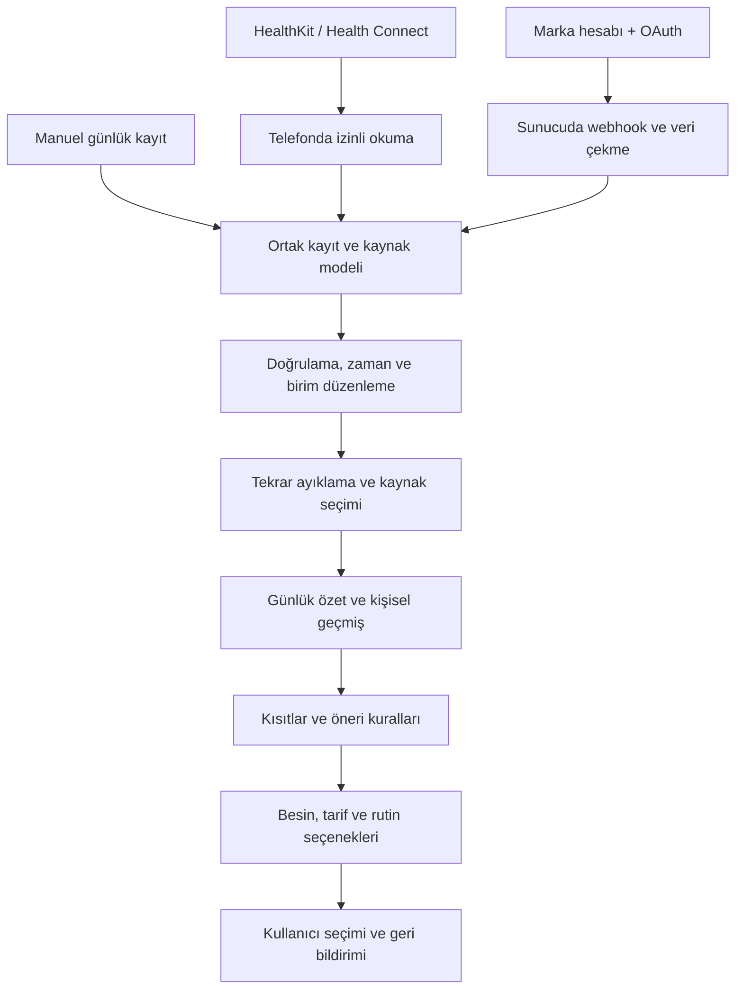

# Akıllı cihaz ve sağlık verisi planı

7 Eylül 2026 · Teknik ve ürün önerisi. Üretici belgeleri bu tarihte kontrol edildi. Uygulama ve hesaplar henüz bağlanmadı. API erişimi, model, ülke, üyelik, firmware, işletim sistemi ve kullanıcının izinleri gerçek kapsamı etkiler.

## 1. Üç bağlantı yolu

**Telefon sağlık merkezi:** iOS'ta HealthKit, Android'de Health Connect. Kullanıcının cihaz/üretici uygulamasından merkeze aktarılan ve izin verdiği veriyi okuruz. Temel sürümün ana yolu budur. Bu merkezlerin erişim modelleri ve veri tipleri ayrıdır. [Apple veri tipleri](https://developer.apple.com/documentation/healthkit/data-types), [Health Connect veri tipleri](https://developer.android.com/health-and-fitness/health-connect/data-types).

**Marka hesabı:** Oura, WHOOP, Garmin, Google Health ve benzeri servislerde kullanıcı hesabı üzerinden izinli bulut verisi alınır. Markaya özgü özetler için bu yol gerekir. Telefon sağlık merkezine aynı bilginin eksiksiz taşındığı varsayılmaz.

**Doğrudan saat/sensör:** watchOS/Wear OS yardımcı uygulaması veya belgelenmiş üretici SDK/Bluetooth profili. Canlı antrenman ve desteklenen sensör oturumları içindir. Her saati/yüzüğü genel bir Bluetooth taramasıyla bağlayıp tüm ham veriyi okuyabileceğimiz varsayılmaz. Android Health Services saat üzerinde ayrı bir katmandır. [Wear OS Health Services](https://developer.android.com/health-and-fitness/health-services).

## 2. Entegrasyon matrisi

“Doğrulanan” resmi belgede yolun bulunduğunu ifade eder; uygulamamızda test edilip teslim edildiği anlamına gelmez.

| Kaynak / cihaz ailesi | Önerilen erişim | İlk hedef veri | Aşama ve koşul |
|---|---|---|---|
| Apple Watch ve Apple Health'e yazan uyumlu uygulamalar | iPhone HealthKit | Uyku, adım, antrenman, nabız; varsa diğer izinli ölçümler | F1; kaynak ve model bazında kapsam testi |
| Android telefon ve Health Connect'e yazan uygulamalar | Telefon Health Connect | Uyku, adım, aktivite; varsa nabız, ölçümler, su | F1; uygulama eşitlemesi ve veri tipi izinleri gerekir |
| Galaxy Watch | Samsung Health → Health Connect | Desteklenen adım, egzersiz, nabız, uyku | F1 telefon yolu; üretici eşitleme sıklığına bağlı |
| Galaxy Ring | Samsung Health veri deposu; temel aktarımın Health Connect üzerinden fizibilitesi | Gerçekte paylaşılan uyku/aktivite verileri | F1 test havuzu; Ring için Health Connect alanları tek tek doğrulanır. Zengin veri için F2 Samsung SDK |
| Samsung'a özgü Energy Score vb. | Samsung Health Data SDK | SDK'nin izin verdiği özel özetler | F2; dağıtım için Samsung ortaklık onayı gerekir |
| Oura Ring | Oura API V2 + OAuth2 | Uyku, aktivite, readiness ve izinli diğer göstergeler | F2'de ilk doğrudan yüzük adayı; uygulama erişimi ve üyelik koşulları test edilir |
| WHOOP | API V2 + OAuth2 + V2 webhook | Recovery, strain, uyku, antrenman | F2; marka hesaplı, sunucu gerektiren bağlantı |
| Fitbit / Pixel Watch | Google Health API + Google OAuth2 | Desteklenen aktivite, uyku ve sağlık veri tipleri | F2; restricted scope incelemesi; eski Fitbit API ile başlanmaz |
| Garmin | Garmin Connect Health API | Günlük aktivite, uyku, nabız ve sunulan özel özetler | F2; program onayı ve ticari koşullar; cihaz önce Connect'e eşitlenir |
| Withings saat/tartı/ölçüm cihazları | Withings Data API + hesap izni + bildirimler | Cihaza ve API paketine uygun ölçümler | F2; önce tartı/kilo kullanım senaryosu ve erişim kapsamı doğrulanır |
| Ultrahuman Ring | Resmi OAuth geliştirici erişimi | Yetkilendirilen yüzük metrikleri | F2 sonu; portal, kullanım şartları ve endpoint kapsamı denemesi |
| RingConn | Üretici uygulaması → Health Connect | Resmi belgede desteklenen seçili aktivite, uyku ve ölçümler | F2 test matrisi; HRV'nin bu yoldan geldiği varsayılmaz |
| Polar | AccessLink | İzinli aktivite, uyku ve desteklenen göstergeler | F3; aktif kullanıcı talebine göre |
| Huawei, Amazfit/Zepp, Xiaomi ve diğerleri | Önce sağlık merkezi aktarımı; sonra resmi program fizibilitesi | Yalnız doğrulanmış veri tipleri | F3 araştırma kuyruğu; bu plan destek garantisi vermez |
| Bağımsız BLE nabız bandı / sensör | Belgelenmiş standart profil veya üretici SDK'sı | Desteklenen canlı oturum ölçümleri | F3; model listesi, bağlantı ve pil testleri |
| CGM, ECG ve klinik ölçüm ekosistemleri | Yetkili resmi servis/SDK veya izinli sağlık kaydı | Kullanım amacıyla sınırlı ölçümler | F4; erişim/ülke/uzmanlık değerlendirmesi |

Matriste dayanak olan üretici belgeleri:

- Samsung, Watch verilerinin Samsung Health üzerinden Health Connect'e geçtiğini ve eşitlemenin cihaz politikasına bağlı olduğunu açıklıyor. Data SDK, Galaxy Ring dahil Samsung Health deposuna erişiyor; dağıtım için ortaklık onayı istiyor. [Health Connect FAQ](https://developer.samsung.com/health/health-connect-faq.html), [Data SDK](https://developer.samsung.com/health/data/overview.html), [dağıtım süreci](https://developer.samsung.com/health/data/process.html).
- Oura V2 dokümanı OAuth2 yolunu tanımlıyor; kişisel erişim tokenları Aralık 2025 itibarıyla kaldırılmış. Yeni ürün OAuth üzerinden kurulmalı. [Oura API](https://cloud.ouraring.com/v2/docs).
- WHOOP'un güncel uçları V2; güncelleme/silme olayları için V2 webhook kullanılmalı. [WHOOP API](https://developer.whoop.com/api/), [webhook belgeleri](https://developer.whoop.com/docs/developing/webhooks/).
- Google, eski Fitbit Web API için Eylül 2026 kapanış takvimi bildiriyor. Yeni Google Health API'de Fitbit ve Pixel cihaz verileri, Google OAuth ve restricted scope incelemesi bulunuyor. Kesin kapanış günü bu sayfada belirtilmiyor. Yol haritasındaki veri tipi yayımlanmış kabul edilmez; endpoint üzerinde doğrulanır. [Google Health API](https://developers.google.com/health/about?hl=en).
- Garmin verisi cihazın Connect'e eşitlemesinden sonra alınır; API programı onay gerektirir. Gerçek zamanlı Garmin SDK ayrı ürün ve ticari kapsamdır. [Garmin Health API](https://developer.garmin.com/gc-developer-program/health-api/), [Garmin Health SDK](https://developer.garmin.com/health-sdk/overview/).
- Withings bildirimi sunucuda yeni veri olduğunda gönderir; ardından veri API'den çekilir. Standart hizmette kesin gerçek zaman garantisi yoktur. [Withings bildirimleri](https://developer.withings.com/developer-guide/v3/data-api/notifications/notification-overview/).
- Ultrahuman resmi portalı kullanıcı bazında OAuth erişimi sunuyor. RingConn'un resmi Health Connect açıklaması seçili veri kapsamını ve HRV sınırlamasını belirtiyor. Polar resmi API'si ayrı bir bağlayıcı adayıdır. [Ultrahuman](https://vision.ultrahuman.com/developer), [RingConn](https://ringconn.com/blogs/guides/health-connect-sync), [Polar](https://www.polar.com/accesslink-api/).

Öncelik önerisi: **HealthKit + Health Connect → Oura → kullanıcı cihaz dağılımına göre Google Health / WHOOP / Garmin / Withings → diğer yüzükler ve saatler → canlı yardımcı uygulamalar.** Marka sırası pazar payı iddiası değildir; ilk pilotun cihaz dağılımına göre güncellenir.

## 3. Hangi veri hangi iş için kullanılacak?

| Veri | Kullanım | Çıkarılmayacak sonuç |
|---|---|---|
| Uyku başlangıç/bitiş, süre ve öznel dinlenmişlik | Akşam rutini, günlük yük tercihi, kayıt eğilimi | Tek geceden hastalık veya besin eksikliği |
| Adım, aktif süre, antrenman | Hareket dengesi, uygun süreli rutin seçimi | Kesin kalori ihtiyacı veya zorunlu egzersiz |
| Dinlenik nabız / HRV | Aynı kaynaktaki kişisel geçmişi inceleme | Evrensel stres, kondisyon veya hastalık tanısı |
| Marka readiness/strain/energy skoru | Kaynak adıyla gösterme ve isteğe bağlı bağlam | Markalar arasında ortak sağlık puanı |
| SpO2, solunum hızı, cilt sıcaklığı | İsteğe bağlı ölçüm/eğilim ekranı | Uygulamamızın apne, enfeksiyon veya ateş tanısı |
| Kilo ve vücut bileşimi | Kullanıcı hedefi varsa trend | Tek ölçümden kesin yağ değişimi |
| Döngü ve belirtiler | İsteğe bağlı günlük plan bağlamı | Gebelikten korunma veya kesin ovülasyon günü |
| Gerçek öğün tüketimi, miktar, su ve kafein | Beslenme kaydı, çeşitlilik ve öğün seçenekleri | Eksik günlükten eksiksiz besin alımı |
| Alerji / intolerans / tercih | Zorunlu eleme ve kullanıcıya uygun alternatif | Cihaz verisiyle kısıtı kaldırma |
| Ruh hali, enerji ve müsait zaman | Önerinin uygulanabilirliğini artırma | Ruhsal tanı veya tedavi |
| Tansiyon, glikoz, ECG | İlgili aşamada kayıt ve izinli paylaşım | Otomatik ilaç/insülin dozu veya acil takip garantisi |

HRV özel durumu: Apple'ın ilgili HealthKit tipi **SDNN**, Android'in ilgili Health Connect tipi **RMSSD** ölçüsüdür. Milisaniye birimleri aynı olsa bile aynı metrik gibi ortalamaları alınmaz. Kaynak, yöntem ve ölçüm bağlamı korunur. [Apple HRV](https://developer.apple.com/documentation/healthkit/hkquantitytypeidentifier/heartratevariabilitysdnn?changes=_7__8), [Android HRV](https://developer.android.com/reference/androidx/health/connect/client/records/HeartRateVariabilityRmssdRecord).

## 4. Veri mimarisi

Şema mantıksal akıştır. Telefon kayıtlarının buluta aktarımı ayrı izin gerektirir; F1'de ortak model, özetler ve öneriler cihazda çalışabilir. Markanın bulut bağlayıcısında yalnız istenen veri alınır. Hesaplar arası yetkilendirme veri erişim katmanında uygulanır.

Önerilen bileşenler:

- Flutter: günlük deneyim, kayıt akışları, izin gerekçeleri, kaynak/güncellik gösterimi.
- Swift/Kotlin adaptörleri: işletim sistemi erişimi, değişiklik okuma, arka plan imkânları; Flutter paketi yetersizse native köprü.
- Yerel sürümlü veritabanı: günlük kayıtlar, izinli sağlık kayıtları, kaynaklar ve eşitleme imleçleri. Hassas veri şifreli; ayarlar SharedPreferences'ta kalabilir.
- Entegrasyon backend'i: OAuth, webhook doğrulama, kuyruk, yeniden deneme, veri normalizasyonu, token yenileme ve iptal.
- Öneri servisi: alerjen elemesi, seçenek üretme, gerekçe ve kural sürümü. İlk sürümde cihazda yürütülebilir.
- İçerik ve işletim: tarif/besin kaynağı, uzman onayı, içerik sürümü, bağlantı durumu izlemesi. Operasyon ekranları varsayılan olarak ham sağlık içeriği göstermez.

## 5. Ortak kayıt sözlüğü

| Varlık | Asgari alanlar / karar |
|---|---|
| HealthObservation | id, kullanıcı, metrik, değer/birim veya örnek dizisi, başlangıç/bitiş UTC, özgün saat dilimi/offset, ölçüm yöntemi, kaynak |
| ObservationProvenance | üretici, kaynak uygulama, cihaz/model varsa, dış kayıt kimliği, özgün kaynağın kimliği varsa, alınma/güncellenme zamanı |
| ObservationQuality | kayıt kapsamı, güncellik, geçerli/eksik/şüpheli durum ve nedeni; üretici vermiyorsa sahte sensör güven puanı yok |
| SleepSession | oturum, başlangıç/bitiş, ana uyku/kestirme, evreler varsa; gece yarısında zorunlu parçalanmaz |
| DailyCheckIn | tarih/saat, enerji/ruh hali/uyku hissi ve isteğe bağlı yanıtlar; geçmiş korunur |
| Consumption | tüketildiği zaman, miktar, birim, tarif/ürün kaynağı ve besin değeri sürümü |
| UserConstraint | alerji, intolerans, tıbbi kısıt veya tercih türü; besin kimliği, kullanıcı onayı ve güncelleme tarihi |
| ConsentGrant / Connection | amaç, veri tipleri, read/write kapsamı, verilme/iptal zamanı, sağlayıcı ve bağlantı durumu |
| SyncCursor | sağlayıcı, kullanıcı, kapsam, sayfalama/değişiklik imleci ve son başarılı kontrol |
| DailySummary | gün tanımı, kaynak seçim politikası sürümü, gözlem referansları, kapsam, hesap sürümü |
| Recommendation | seçenek, gerekçe, kullanılan gözlemler, kısıt sürümü, kural sürümü ve geçerlilik zamanı |
| UserFeedback | seçtim/değiştirdim/atladım/uyguladım ve isteğe bağlı neden; tüketimden ayrı |

Bir uygulamanın “ham kayıt okuma” API'si bulunması ham PPG veya sürekli sensör dalga biçimine eriştiğimiz anlamına gelmez. Bu planın başlangıç verisi üreticinin sunduğu kayıtlar ve özetlerdir.

## 6. Eşitleme ve veri doğruluğu

1. **İzin ve yetenek:** kaynak bağlı mı, istenen veri tipi destekleniyor mu, erişim kapsamı yeterli mi kontrol edilir. Desteklenmeyen özellik kapalı veya manuel alternatifli görünür.
2. **İlk geçmiş:** F1 için izinli son 30 günlük pencere hedeflenir; daha eski veri ancak özellik gerekçesi ve ek izinle istenir. Android'in varsayılan geçmiş sınırı ilk izin tarihinden önceki 30 gündür; arka plan ve geniş geçmiş erişimi ayrıca yönetilir. [Android okuma kuralları](https://developer.android.com/health-and-fitness/health-connect/read-data).
3. **Artımlı okuma:** ilk alımdan sonra değişiklik imleçleri/üretici webhook'ları kullanılır. Sayfalama tamamlanmadan eşitleme başarılı sayılmaz.
4. **Tekrara dayanıklılık:** aynı webhook veya veri paketi tekrar gelirse yeni kayıt çoğaltılmaz. Dış kayıt kimliği ve revizyon/güncelleme zamanı kullanılır.
5. **Birim ve zaman:** UTC ile özgün offset korunur; kg/lb, ml/fl oz gibi dönüşümler tek yerde yapılır. Geçersiz veya çelişkili veri hesaplardan ayrılır; kaynağı kaybolmaz.
6. **Kaynak çakışması:** aynı Oura uykusu hem doğrudan API'den hem HealthKit'ten gelirse tek analitik oturum kullanılır. Köken kimliği yoksa kontrollü zaman/kaynak eşleştirmesi yapılır; emin olunamayan kayıt körlemesine birleştirilmez.
7. **Kümülatif ölçüm:** telefon ve saat adımları toplanmaz. Health Connect'te uygun aggregate API kullanılır; harici marka akışıyla da ayrıca çakışma çözülür. Platform toplamı ile bağımsız API toplamı tekrar toplanmaz. [Android toplama önerisi](https://developer.android.com/health-and-fitness/health-connect/read-data).
8. **Kaynak tercihi:** metrik bazında varsayılan kaynak politikası, gerekirse kullanıcının tercihi vardır. Uyku için bir kaynak, kilo için başka kaynak seçilebilir. Tercih değişince ilgili özetler yeniden hesaplanır.
9. **Yeniden işleme:** üretici bir uyku kaydını düzeltir veya silerse etkilenen özet ve öneri dayanakları güncellenir. Değişiklik geçmişi gereksiz ham veri çoğaltmadan tutulur.
10. **Eksik veri:** “kayıt yok”, “son veri dün”, “kaynak bağlı değil” ayrıdır; 0 adım veya 0 saat uyku varsayılmaz. HealthKit, okuma izni reddini kesin olarak öğrenmeye izin vermediği için boş sonuç “izin reddedildi” diye etiketlenmez. [HealthKit izinleri](https://developer.apple.com/documentation/HealthKit/authorizing-access-to-health-data?changes=_2).
11. **Kesinti yönetimi:** gecikmeli veri, hız limiti, token süresi, ağ kesintisi ve webhook tekrarları için kuyruk, kontrollü yeniden deneme ve geri doldurma bulunur. Kullanıcıya son başarılı eşitleme gösterilir.
12. **Okuma/yazma döngüsü:** yalnız uygulamanın gerçekten oluşturduğu, kullanıcıca onaylanan kayıtlar dışarı yazılır. Kaynak kimliği ve dışa aktarım eşlemesiyle kendi yazdığımız kayıt yeniden içeri alınıp çoğaltılmaz.

Android arka plan işi ve Apple arka plan teslimi kesin zamanlı alarm sistemi sayılmaz. Üretici uygulamasının kapalı olması veya cihazın eşitlenmemesi gecikme yaratabilir. F1 kullanıcıya “canlı sağlık takibi” vaat etmez; hangi kaydın ne zaman geldiğini gösterir.

Gün sınırı önerisi: check-in ve günlük plan için ürünün mevcut 06.00 politikası açıkça tanımlanabilir; uyku oturumları bu sınırla kesilmez. Günlük uyku özeti ana uykunun sona erdiği yerel güne bağlanır; kestirmeler ayrıdır. Aktivite platformun yerel gün toplamıyla uyumlu tutulur. Farklı gün tanımları karşılaştırmada açıklanır.

## 7. Veriden öneriye örnekler

| Senaryo | Uygulamanın davranışı |
|---|---|
| Kullanıcı enerjisini düşük, zamanını 15 dakika belirtiyor; kısa uyku kaydı var | Kolay hazırlanabilen uygun öğünler ve isteğe bağlı hafif rutin gösterir; önerinin zaman ve özbildirim gerekçesini açıklar |
| Aktivite kaydı var; kullanıcı öğün atladığını belirtiyor | Tüketim kaydını tamamlamayı ve uygun öğün seçeneklerini sunar; cihaz kalorisinden kesin porsiyon dayatmaz |
| Akşam kafein kaydı ve uyku günlüğü birkaç haftadır mevcut | Yeterli kayıt varsa birlikte inceleme sunar; “kafein kesin sebep” demez |
| Nabız/HRV olağan geçmişten farklı; özbildirim yok | Kaynaklı eğilimi gösterir ve nasıl hissedildiğini sorar; besin takviyesi/teşhis üretmez |
| Süt alerjisi var; laktozsuz süt içeren tarif bulundu | Zorunlu elemede tarifi dışarıda bırakır; tercih skoru bunu geçersiz kılamaz |
| Cihaz verisi eski veya kullanıcı izin vermedi | Manuel günlük kayıtla aynı temel beslenme/rutin deneyimi sürer |

Kişisel eğilimlerin ilk prototipi için örneğin son 28 günde en az 14 geçerli gün gibi bir ürün eşiği test edilebilir. Bu sayı klinik olarak doğrulanmış eşik değildir; metrik ve kayıt yoğunluğuna göre pilotta seçilir. Çıktıda kayıt sayısı, tarih aralığı ve kaynak görünür. Cihaz veya yöntem değiştiğinde geçmiş kesintisi işaretlenir.

## 8. İzin, mahremiyet ve saklama

Sağlık verisi KVKK'da özel nitelikli veri kapsamındadır; veri işleme sebebi, aydınlatma, amaç, yeterli önlemler ve aktarım düzeni ürünün veri akışına göre belirlenmelidir. İşletim sistemi erişim izni tüm hukuki yükümlülükleri karşılayan tek bir onay gibi ele alınmaz. [KVKK açıklaması](https://www.kvkk.gov.tr/Icerik/2051/Ozel-Nitelikli-Kisisel-Veriler).

Önerilen kontroller:

- İzinler bağlam içinde istenir: uyku ekranında uyku okuma, su dışa aktarımında su yazma. İlgisiz tüm sağlık izinleri kurulumda topluca istenmez.
- Telefon erişimi, bulutta eşitleme, AI açıklaması ve uzmanla paylaşım ayrı amaçlardır. Birini reddetmek temel deneyimi kapatmaz.
- OAuth sırları uygulama paketine konmaz. Tokenlar sunucuda anahtar yönetimiyle korunur; cihaz oturum sırları Keychain/Keystore'da saklanır. Sağlayıcının desteklediği güvenli OAuth akışı, state ve destekliyorsa PKCE kullanılır.
- Ağ aktarımı şifreli; sağlık verisi cihazda/sunucuda şifreli; backend rol ve kullanıcı kapsamıyla sınırlandırılmış olmalıdır. Hassas ekranlar ve sağlık değerleri genel analitik/crash loglarına gönderilmez.
- Erişim geri çekildiğinde yeni alım ve ilgili kullanım durur. “Bağlantıyı kaldır” ile “alınmış veriyi sil” ayrı sonuçlarıyla açıklanır; silme akışı kolay erişilir.
- Kullanıcı bizdeki veriyi silebilir. Üretici hesabındaki kayıtları silmiş gibi vaat verilmez. Yalnız uygulamanın dışarı yazdığı kayıtların yönetimi ayrı desteklenir.
- Hesap silme sırasında gözlemler, türetilmiş özetler, arama/AI önbellekleri ve tokenlar kapsama alınır. Yedeklerdeki gecikmeli silme politikası kullanıcıya açıklanır; geri yükleme silinmiş veriyi canlandırmamalıdır.
- Başlangıç saklama önerisi: ham webhook gövdeleri işlem tamamlanınca kaldırılır; hata ayıklama kopyası zorunluysa en fazla 7 gün ve erişim kısıtı. Günlük ayrıntı önbelleği için 30 gün, kişisel özetler için kullanıcı seçimine bağlı süre düşünülebilir. Bunlar ürün önerisidir; mevzuat veya üretici şartı olarak sunulmaz. Kesin süreler F0'da kullanım amacıyla belirlenir.
- Sağlık verisi reklam hedefleme, sigorta/işveren puanı veya üçüncü taraf model eğitimi için kullanılmaz. AI'ya varsayılan olarak ham sağlık dizileri gönderilmez; özellik açılırsa asgari gerekli özet ve uygun veri işleme şartları kullanılır.
- Bulut bölgesi ve alt işleyenler, Türkiye'den yurt dışına aktarım dahil veri akışına göre incelenir. Avrupa açılımında GDPR değerlendirmesi ayrıca yapılır; tek bir izin ekranı evrensel uyumluluk sağlamaz.

Apple'ın sağlık verisinin kullanımı ve doğruluğuna ilişkin mağaza kuralları ile Android'in veri tipi/Play beyanları yayın öncesi kontrol edilir. Google Health API'deki restricted scope incelemesi ayrı süreçtir. [Apple sağlık ve araştırma kuralları](https://developer.apple.com/app-store/review/guidelines/#health-and-health-research), [Android veri tipi izinleri](https://developer.android.com/health-and-fitness/health-connect/data-types), [Google Health erişimi](https://developers.google.com/health/about?hl=en).

## 9. Cihaz testleri ve kabul senaryoları

F0/F1 test seti: gerçek bir iPhone + Apple Watch, Health Connect bulunan Android + Galaxy Watch, ikinci Android sürümü/üretici, cihazsız telefon. Galaxy Ring erişimi ayrı test kaydıdır. F2'de her marka bağlayıcısı için gerçek hesap/cihaz ve sağlayıcının sunduğu test imkânları kullanılır; emülatör tek başına yeterli değildir.

| Senaryo | Beklenen sonuç |
|---|---|
| Kullanıcı yalnız uyku izni verir | Uyku çalışır; diğer izinler olmadan uygulama açılır |
| HealthKit boş sonuç döndürür | “Kayıt bulunamadı”; kesin izin reddi veya sıfır uyku çıkarımı yok |
| Android geniş geçmiş/arka plan izni yoktur | İzinli kapsamda ön planda okuma; anlaşılır eksik kapsam |
| Aynı uyku ring API ve sağlık merkezinden gelir | Analitikte tek oturum; iki kaynak bilgisi izlenebilir |
| Telefon ve saat aynı yürüyüşü kaydeder | Adım toplamı iki katına çıkmaz |
| Sağlayıcı kaydı günceller/siler | İlgili grafik ve türetilen özet düzelir |
| Webhook iki kez veya sıra dışı gelir | Yinelenen kayıt oluşmaz; eski sürüm yeniyi ezmez |
| Token iptal edilir veya 429 alınır | Sonsuz döngü yok; yeniden deneme/bağlanma durumu görünür |
| Gece yarısı, 06.00 sınırı, yaz saati ve seyahat | Süre değişmez; uyku oturumu doğru güne bağlanır |
| SDNN ve RMSSD birlikte gelir | Ayrı seriler; yanıltıcı tek HRV ortalaması oluşmaz |
| Kaynak bir gün eksik, sonraki gün gecikmeli veri gelir | Eksik gün sıfır sayılmaz; veri gelince özet yeniden hesaplanır |
| Cihaz/method değişir | Trend kırılımı ve yeni kaynak belirtilir |
| Uygulamanın yazdığı su kaydı geri okunur | Tüketim iki kez sayılmaz |
| Kullanıcı alerjisini değiştirir | Açık öneri ve alternatifler yeniden denetlenir |
| Kullanıcı bağlantıyı kapatır/verisini siler | Yeni alım durur; seçilen kapsam ve türetilmiş kayıtlar silinir |
| Ağ yoktur | Manuel kayıtlar ve indirilmiş temel içerik çalışır; güvenli kuyruk sonra eşitlenir |

F0 çıktıları: desteklenen cihaz–veri tipi matrisi, izin ekran prototipi, her platformdan alınmış örnek veri sözleşmesi, kayıt taşıma tasarımı, kaynak ayıklama politikası, backend ihtiyacı ve maliyet tahmini. Bu kanıtlar görülmeden tüm marka logoları “destekleniyor” olarak arayüze konmaz.
